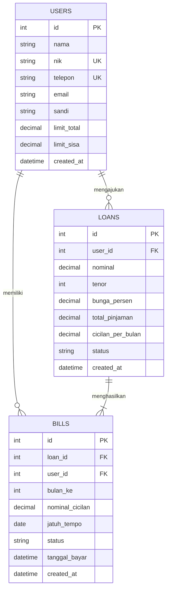

# 💳 ButuhUang - Fintech Platform


> **Proyek Portofolio Mahasiswa Teknik Informatika**  
> Proyek ini merupakan evolusi dan refactoring menyeluruh dari aplikasi pinjaman online era SMK yang dikembangkan dengan arsitektur web full-stack modern, keamanan transaksi finansial, antarmuka responsif, kalkulasi pinjaman real-time, serta resi pembayaran digital.

---

## 🌟 Fitur Utama (Core Features)

1. **🏛️ Landing Page Komprehensif**
   - Hero branding interaktif dengan logo resolusi tinggi (HD).
   - 3 Langkah Cepat Pengajuan Pinjaman dengan background visual deal.
   - Portofolio Statistik Fintech (TKB90 98.30%, akumulasi pinjaman, dan peminjam aktif).
   - Profil PT Pengangguran Sejati berlatar tekstur elegan dengan watermark.

2. **📊 Kalkulator Simulasi Pinjaman Interaktif (`simulasi.php`)**
   - Slider dinamis nominal (Rp 500rb - 20jt) & tenor (1 - 12 bulan) yang dapat diakses publik tanpa harus login.
   - Kalkulasi suku bunga flat transparan ($0.8\%/\text{bulan}$).
   - **Tabel Rincian Jadwal Angsuran**: Menampilkan breakdown pokok, bunga, total angsuran, dan sisa saldo pokok per bulan.

3. **❓ Pusat Bantuan & FAQ Interaktif (`faq.php`)**
   - Accordion UI interaktif untuk menjawab pertanyaan seputar persyaratan, bunga, plafon limit, dan privasi nasabah.
   - Help desk contact card untuk layanan bantuan pengguna 24/7.

4. **🔐 Autentikasi & Keamanan Pengguna (`auth.php`)**
   - Form Masuk & Daftar 2-kolom berdampingan.
   - Enkripsi kata sandi menggunakan `password_hash()` (Bcrypt).
   - Proteksi SQL Injection $100\%$ via **PDO Prepared Statements**.
   - Manajemen sesi aman (`session_start()`, auth protection middleware).

5. **📝 Dashboard Pengajuan Pinjaman (`pinjaman.php`)**
   - Slider nominal dan tenor dengan simulasi cicilan bulanan.
   - Validasi sisa limit nasabah dan generate jadwal tagihan otomatis.

6. **💳 Plafon Limit Pinjaman (`limit.php`)**
   - Kartu plafon pinjaman dinamis (default Rp 69.696.666).
   - Badges syarat KTP, tenor 3-12 bulan, dan bunga maksimal 10%.
   - Shortcut akses cepat dengan ikon resmi **Iconify (Flat Color Icons)**.

7. **📑 Manajemen Tagihan & Resi Digital PDF (`tagihan.php` & `cetak-bukti.php`)**
   - Tab switching interaktif antara **Belum Bayar** dan **Sudah Bayar**.
   - Modal konfirmasi pembayaran angsuran dengan update status lunas real-time dan pemulihan limit otomatis.
   - **🖨️ Cetak Resi / Bukti Lunas Digital**: Format cetak tanda terima transaksi resmi berstempel LUNAS dengan nomor referensi transaksi unik yang siap disimpan/dicetak PDF.

---

## 🏗️ Struktur Direktori

```text
ButuhUang/
├── assets/
│   ├── css/
│   │   └── style.css            # Stylesheet utama & responsif
│   ├── js/
│   │   └── main.js              # Slider JS, loan calculator & modal payment
│   └── images/
│       ├── logo.png             # Logo resmi ButuhUang (HD Upscaled)
│       ├── hero-bg.jpg          # Foto hero background
│       ├── handshake-bg.jpg     # Foto background 3 langkah mudah
│       ├── about-bg.jpg         # Foto background tentang kami
│       ├── smartphonemu-qr.jpg  # Ilustrasi smartphone & QR
│       ├── aman-nyaman-idea.jpg # Ilustrasi ide & keamanan
│       ├── icon-tagihan.svg     # Iconify debt/invoice
│       ├── icon-pinjaman.svg    # Iconify money transfer
│       ├── icon-limit.svg       # Iconify sales performance
│       ├── icon-cara.svg        # Iconify rules/workflow
│       └── icon-empty-bill.svg  # Iconify inspection
├── config/
│   └── database.php             # Konfigurasi PDO (Dual engine: SQLite & MySQL)
├── database/
│   ├── butuhuang.sqlite         # Database SQLite lokal (zero-config)
│   └── schema.sql               # Skema tabel
├── handlers/
│   ├── auth_handler.php         # Handler Login & Registrasi
│   ├── loan_handler.php         # Handler Pengajuan Pinjaman
│   ├── payment_handler.php      # Handler Pembayaran Tagihan
│   └── logout.php               # Handler Logout
├── includes/
│   ├── header.php               # Head HTML & Session init
│   ├── navbar.php               # Navigasi global
│   ├── sidebar.php              # Sidebar navigasi dashboard
│   └── footer.php               # Footer perusahaan & scripts
├── auth.php                     # Halaman Masuk & Daftar
├── cara-pinjam.php              # Halaman Panduan Transaksi
├── cetak-bukti.php              # Cetak Resi Pembayaran Lunas PDF
├── database.sql                 # Skema & Seeder MySQL untuk phpMyAdmin
├── faq.php                      # Halaman FAQ & Pusat Bantuan
├── index.php                    # Landing Page Beranda
├── limit.php                    # Halaman Limit Pinjaman
├── pinjaman.php                 # Halaman Form Pengajuan Pinjaman
├── simulasi.php                 # Halaman Kalkulator Simulasi Pinjaman
├── tagihan.php                  # Halaman Tagihan Belum/Sudah Bayar
├── tentang.php                  # Halaman Profil Perusahaan
└── README.md                    # Dokumentasi Portofolio
```

---

## 🗄️ Relasi Database (ERD)



---

## 🚀 Cara Menjalankan Aplikasi

### Opsi 1: Menggunakan XAMPP (Rekomendasi)
1. Salin folder proyek `ButuhUang` ke dalam folder `C:\xampp\htdocs\ButuhUang`.
2. Buka **XAMPP Control Panel**, nyalakan **Apache** dan **MySQL**.
3. Buka browser dan akses:
   👉 **`http://localhost/ButuhUang`**

### Opsi 2: Menggunakan PHP Built-in Server (Zero-Config SQLite)
```powershell
cd "C:\Users\kelan\Tugas KLN\ButuhUang"
php -S localhost:8000
```
Akses di browser: `http://localhost:8000`

---

## 👤 Akun Demo Pengujian

| Parameter | Nilai |
| :--- | :--- |
| **Nomor Telepon** | `081234567890` |
| **Kata Sandi** | `password123` |
| **Plafon Limit Awal** | Rp 69.696.666 |
